# reelay

  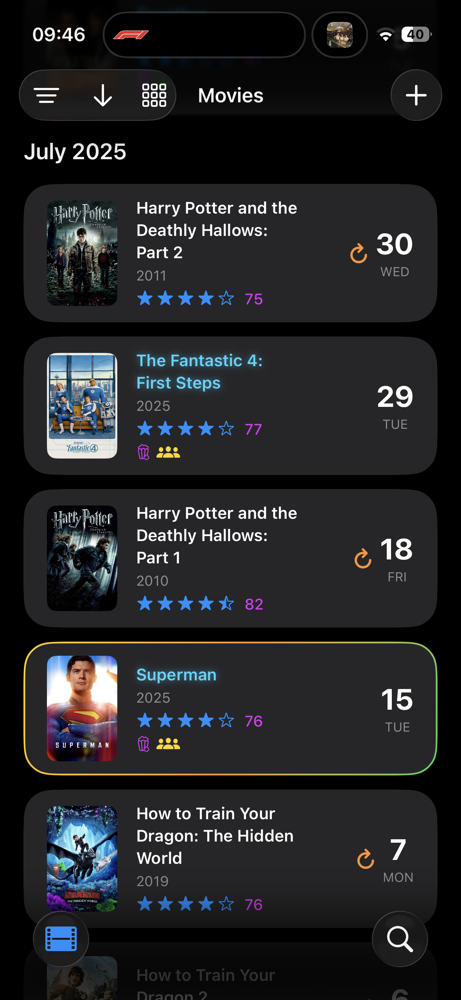

A personal media hub for tracking movies, music, and TV shows with rich metadata, customization, and analytics. A living, breathing version of my 6 year old multicolored spreadsheet. Always a work in progress, always iterating. Built for iOS 26 first and foremost. 

## Features

### Movie Tracking
- **Timeline View**: Chronological diary of watched movies
- **Custom Lists**: Organize movies into personalized collections
- **Smart Tags**: IMAX, Theater, Family, and more with visual indicators
- **Ratings & Reviews**: 5-star rating system with detailed reviews
- **Statistics Dashboard**: Comprehensive viewing analytics and insights

### Customization
- **Visual Personalization**: Change movie posters and backdrops
- **Custom Metadata**: Add personal notes and viewing context
- **Flexible Organization**: Sort and filter by date, rating, genre, and tags

### Data Management
- **CSV Import**: Bulk import movie lists from external sources
- **Smart Search**: Intelligent filtering and discovery features
- **Offline Support**: Local data storage with cloud sync
- **Data Export**: Export your viewing history and statistics

### Music Integration
- **Album Tracking**: Log and rate music albums
- **Spotify Integration**: Connect with Spotify Web API for metadata

## Tech Stack

- **Frontend**: SwiftUI (iOS 26.0+)
- **Backend**: Custom API server with PostgreSQL
- **APIs**: TMDB API, Spotify Web API
- **Caching**: Redis for performance optimization
- **Database**: Supabase with PostgreSQL
- **Local Storage**: SwiftData for offline functionality

## Requirements

- iOS 26.0 or later
- Xcode 16.0+
- Swift 5.0+

## Screenshots

### Home

  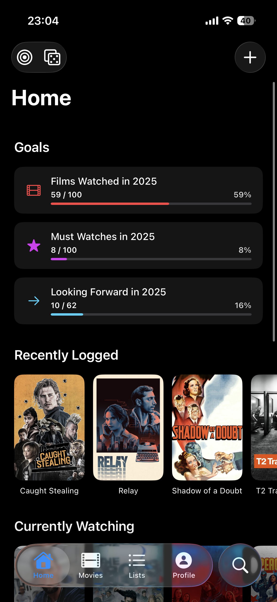
  
  

### Movie Tracking

  
  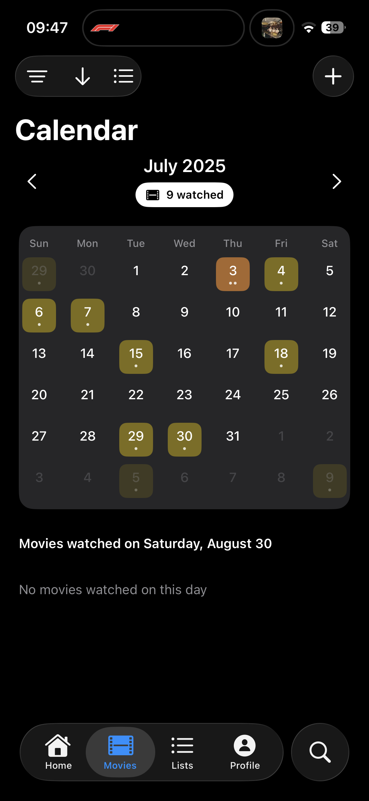
  

### Filtering & Search

  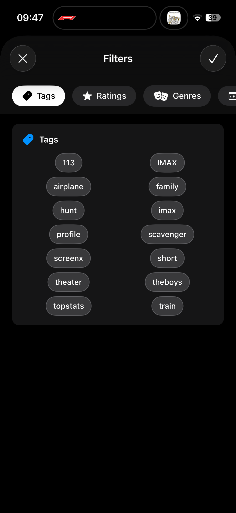
  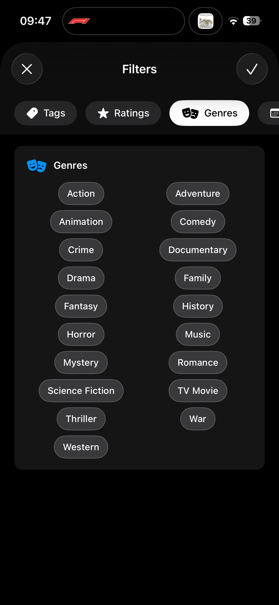
  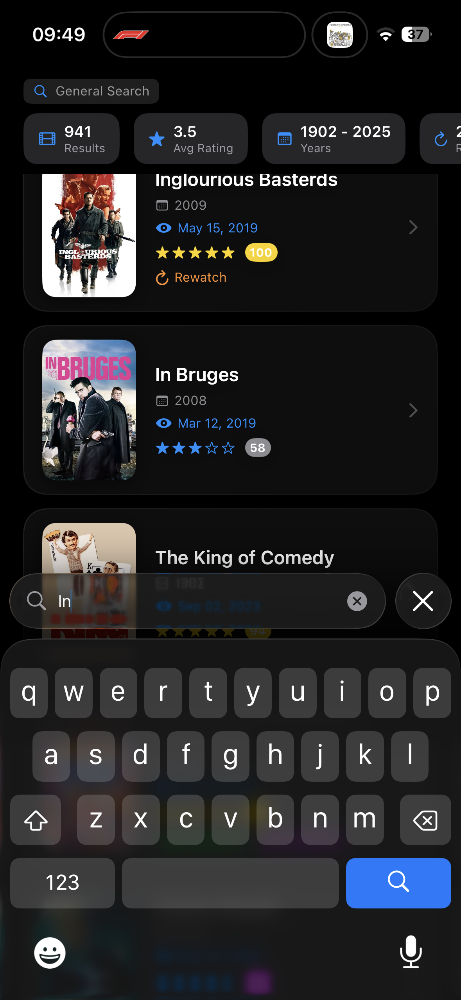

### Adding Content

  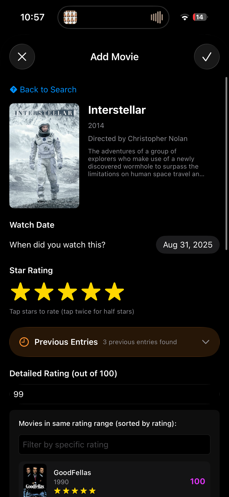
  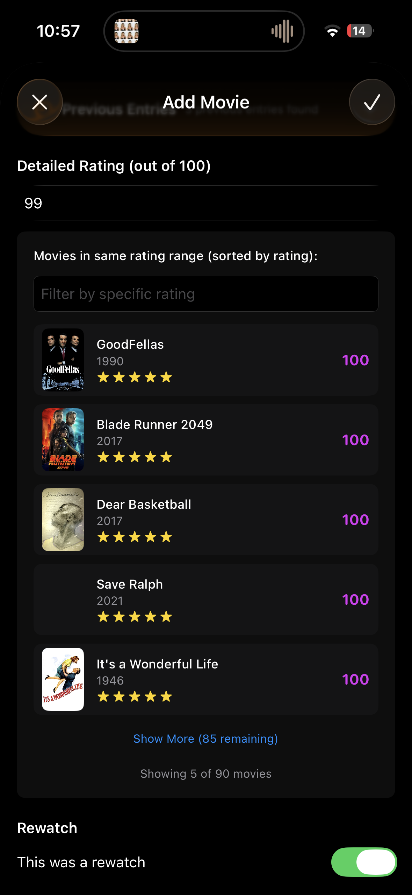
  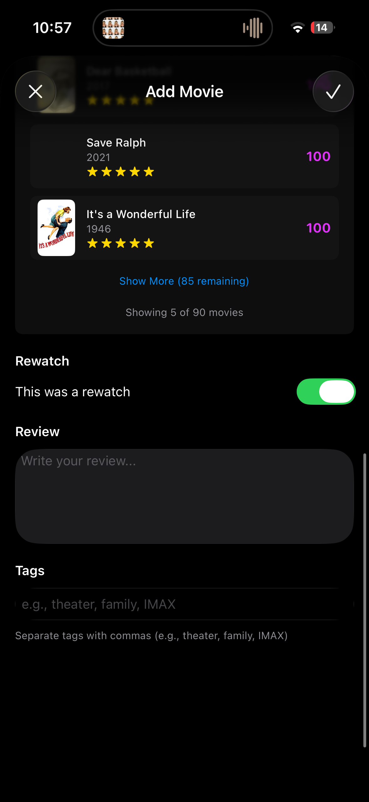

### Lists & Collections

  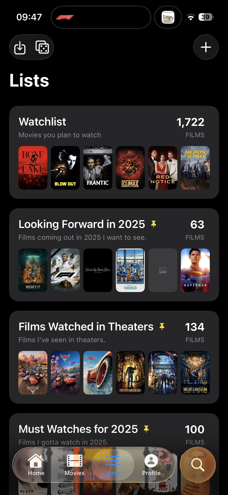
  
  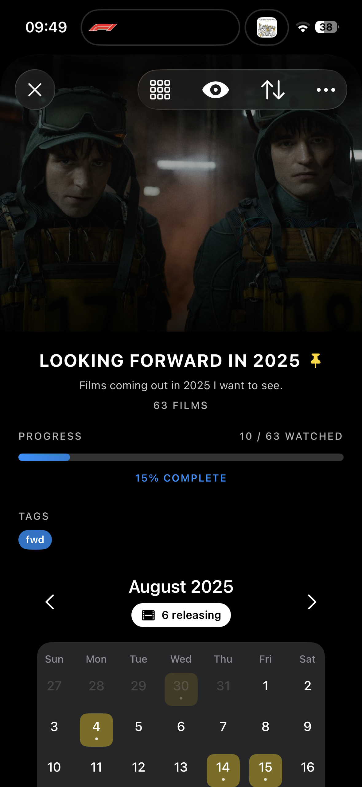
  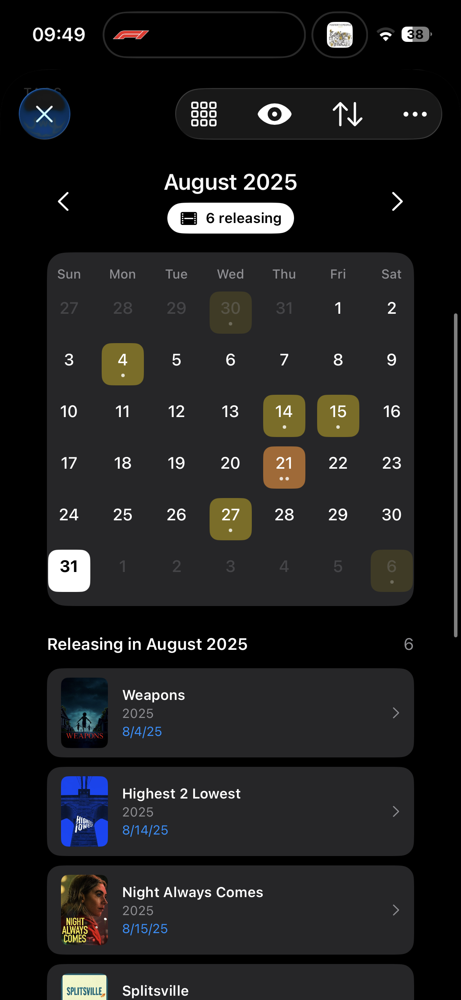

### Statistics & Analytics

  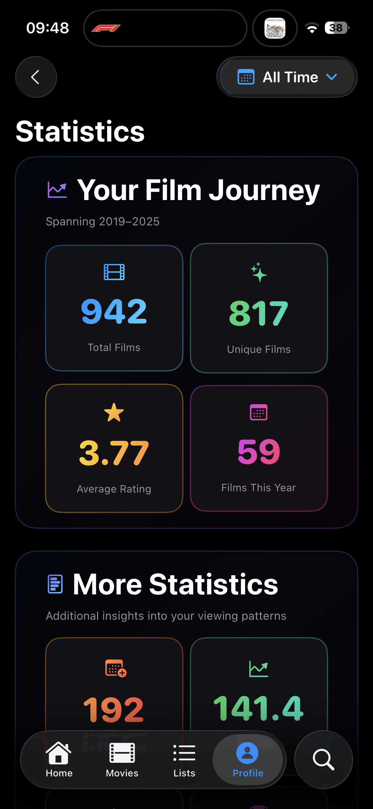
  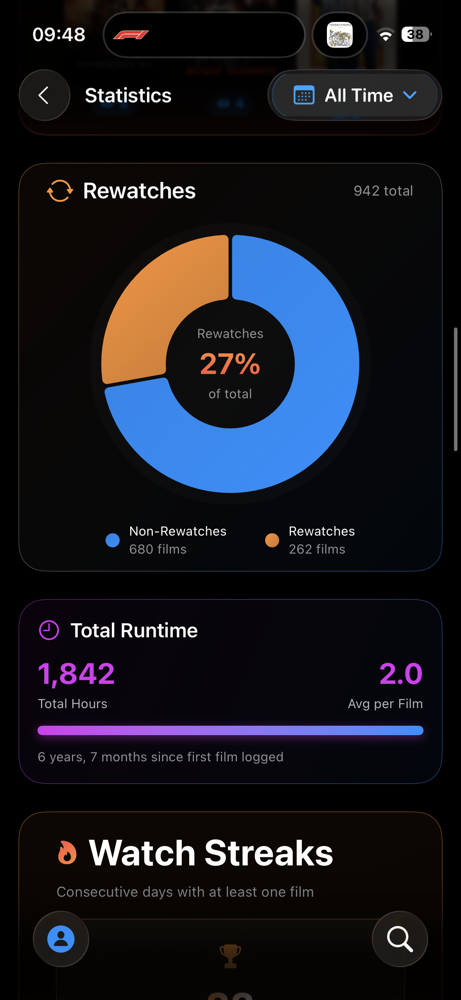
  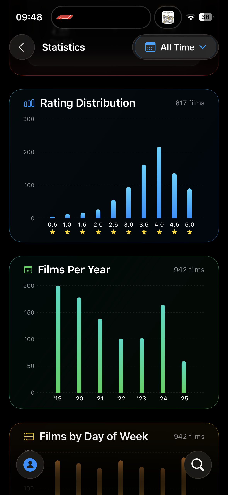

### Music & Television

  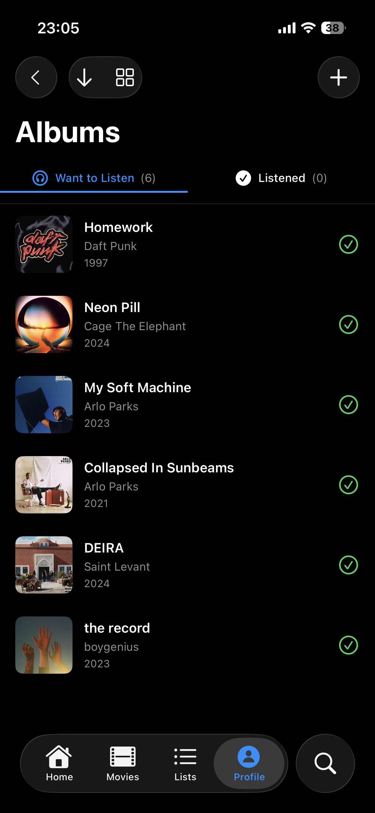
  
  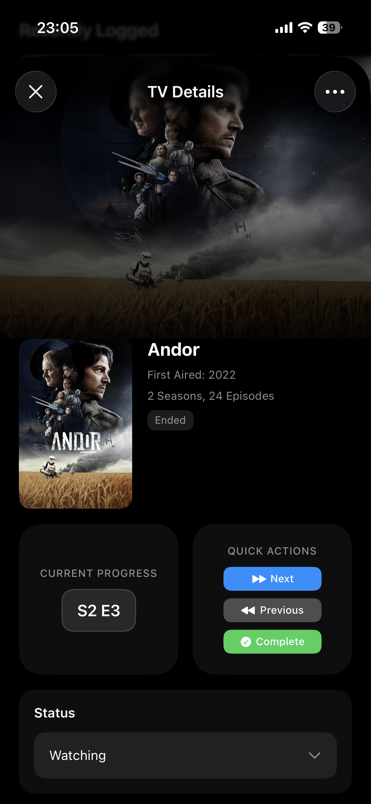

### Profile & Tools

  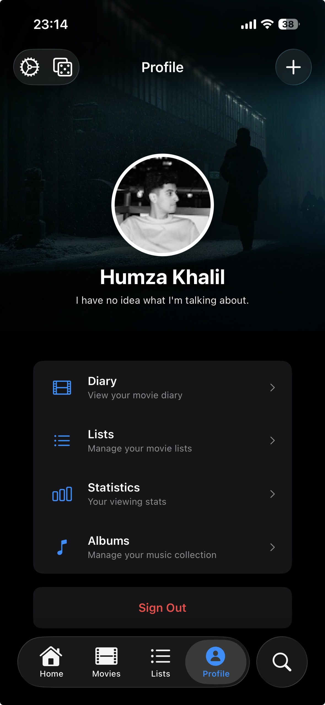
  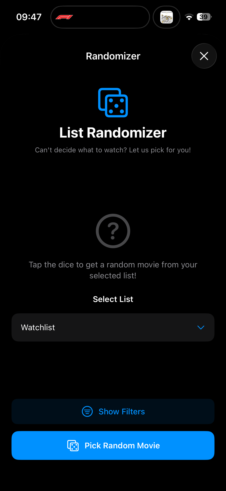

